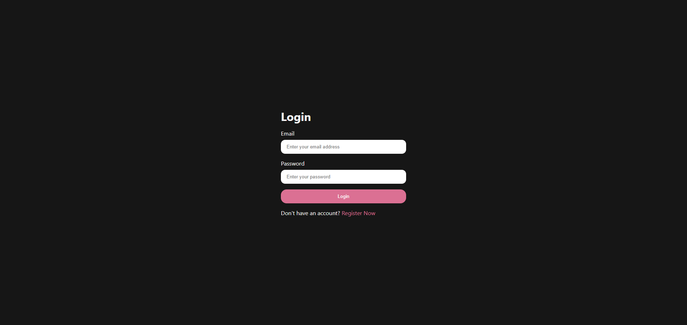
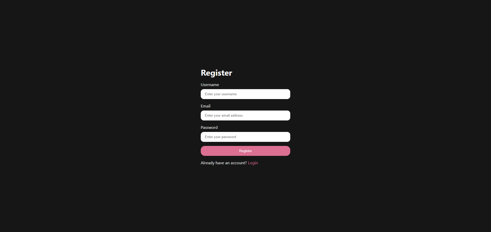
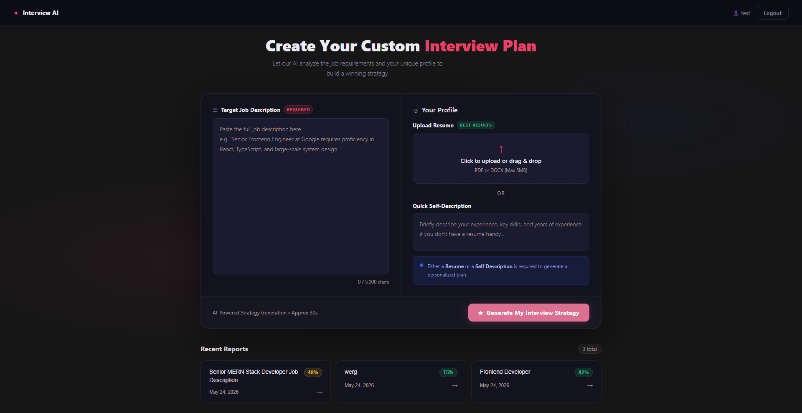
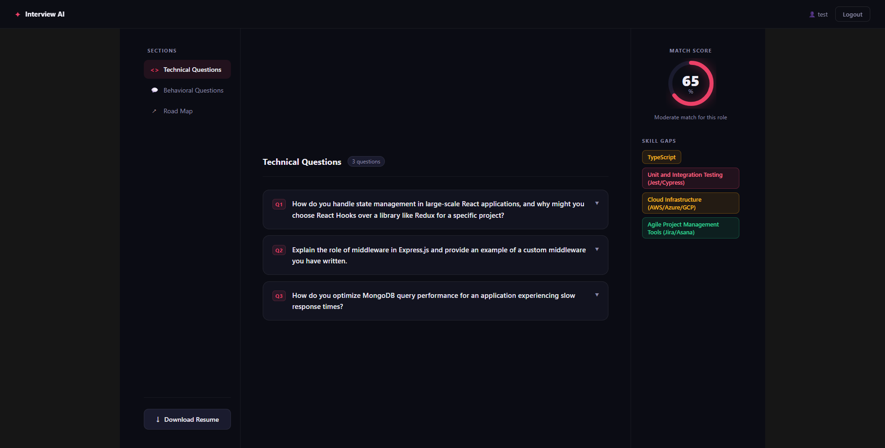

# Interview AI — AI-Powered Interview Preparation Platform

<div align="center">


[](https://interview-ai-zeta-silk.vercel.app/)
[](https://interview-ai-backend-navy.vercel.app)
[](https://nodejs.org)
[](https://react.dev)
[](https://mongodb.com)

**Upload your resume. Paste a job description. Get a tailored interview strategy powered by Google Gemini AI — in under 30 seconds.**

[🚀 Try it Live](https://interview-ai-zeta-silk.vercel.app/) · [📡 API](https://interview-ai-backend-navy.vercel.app) · [🐛 Report Bug](https://github.com/shaontalha/interview-ai/issues)

</div>

---

## Table of Contents

- [Overview](#overview)
- [Features](#features)
- [Tech Stack](#tech-stack)
- [Architecture](#architecture)
- [Screenshots](#screenshots)
- [Getting Started](#getting-started)
- [Environment Variables](#environment-variables)
- [API Reference](#api-reference)
- [Project Structure](#project-structure)
- [Deployment](#deployment)
- [Key Implementation Highlights](#key-implementation-highlights)
- [Contact](#contact)

---

## Overview

**Interview AI** is a full-stack SaaS application that leverages Gemini 3 Flash Preview to generate personalized interview preparation reports. A candidate uploads their resume (PDF), provides a self-description, and pastes a job description — the AI analyzes the match and returns:

- A **match score** between the candidate's profile and the job requirements
- **Technical & behavioral interview questions** with suggested answers and interviewer intent
- **Skill gap analysis** with severity ratings
- A **day-by-day preparation roadmap**
- An **AI-generated, ATS-optimized resume PDF** tailored to the job

---

## Features

| Feature | Description |
|---|---|
| 🤖 AI Interview Report | Gemini 3 Flash Preview analyzes resume vs job description and generates a full prep report |
| 📄 PDF Resume Upload | Extracts text from uploaded PDF resumes using `pdf-parse` |
| 📝 AI Resume Generator | Generates an ATS-friendly HTML resume rendered to PDF via Puppeteer |
| 🔐 JWT Authentication | Secure cookie-based auth with token blacklisting on logout |
| 📊 Match Score | Percentage score showing how well the candidate fits the role |
| 🗺️ Preparation Roadmap | Structured day-by-day study plan |
| 🧠 Skill Gap Analysis | Identifies missing skills with low/medium/high severity |
| 📱 Responsive Design | Mobile-friendly dark UI built with SCSS |
| 🕘 Report History | All past reports saved and accessible from the home page |

---

## Tech Stack

### Frontend
- **React 19** with React Router v7
- **SCSS** for styling (dark theme, CSS custom properties)
- **Axios** for API communication (cookie-based auth)
- **Context API** for global state management

### Backend
- **Node.js + Express** REST API
- **MongoDB + Mongoose** for data persistence
- **Google Gemini 3 Flash Preview** via `@google/genai` SDK
- **Zod + zod-to-json-schema** for structured AI output
- **pdf-parse** for PDF text extraction
- **Puppeteer Core + @sparticuz/chromium** for serverless PDF generation
- **JWT + bcryptjs** for authentication
- **Token blacklist** model for secure logout

### DevOps
- **Vercel** for both frontend and backend deployment
- **MongoDB Atlas** for cloud database

---

## Architecture

```
┌──────────────────────────────────────────────────────────────┐
│                        Frontend (React)                      │
│                                                              │
│   Home.jsx ──► useInterview ──► interview.api.js             │
│   Interview.jsx                      │                       │
│   Navbar.jsx                         │Axios (withCredentials)│
└──────────────────────────────────────┼───────────────────────┘
                                       │
                                       ▼
┌──────────────────────────────────────────────────────────────┐
│                      Backend (Express)                       │
│                                                              │
│   /api/auth      ──► auth.controller      ──► userModel      │
│   /api/interview ──► interview.controller                    │
│                              │                               │
│                              ▼                               │
│                        ai.service.js                         │
│                    ┌─────────────────┐                       │
│                    │  Gemini Flash   │                       │
│                    │      API        │                       │
│                    └─────────────────┘                       │
│                              │                               │
│                       Puppeteer Core                         │
│                      (PDF Generation)                        │
└──────────────────────────────────────────────────────────────┘
                               │
                               ▼
               ┌───────────────────────────┐
               │       MongoDB Atlas       │
               │  - users                  │
               │  - interviewreports       │
               │  - blacklisttokens        │
               └───────────────────────────┘
```

---

## Screenshots

### 🔐 Login


### 📝 Register


### 🏠 Home — Generate Report


### 📊 Interview Report — Technical Questions, Match Score & Skill Gaps


---

## Getting Started

### Prerequisites

- Node.js v18+
- MongoDB Atlas account
- Google AI Studio API key ([get one here](https://aistudio.google.com))

### Installation

**1. Clone the repository**
```bash
git clone https://github.com/shaontalha/interview-ai
cd interview-ai
```

**2. Install backend dependencies**
```bash
cd backend
npm install
```

**3. Install frontend dependencies**
```bash
cd ../frontend
npm install
```

**4. Set up environment variables** (see [Environment Variables](#environment-variables))

**5. Run the development servers**

Backend:
```bash
cd backend
npm run dev
```

Frontend:
```bash
cd frontend
npm run dev
```

The app will be running at `http://localhost:5173`

---

## Environment Variables

### Backend `.env`
```env
PORT=5000
MONGO_URI=your_mongodb_atlas_connection_string
JWT_SECRET=your_jwt_secret_key
GOOGLE_GENAI_API_KEY=your_gemini_api_key
NODE_ENV=development
```

### Frontend `.env`
```env
VITE_API_URL=http://localhost:5000
```

---

## API Reference

### Auth

| Method | Endpoint | Description | Auth Required |
|---|---|---|---|
| POST | `/api/auth/register` | Register a new user | No |
| POST | `/api/auth/login` | Login and set cookie | No |
| GET | `/api/auth/logout` | Logout and blacklist token | Yes |
| GET | `/api/auth/get-me` | Get current user | Yes |

### Interview

| Method | Endpoint | Description | Auth Required |
|---|---|---|---|
| POST | `/api/interview` | Generate interview report | Yes |
| GET | `/api/interview` | Get all reports for user | Yes |
| GET | `/api/interview/report/:id` | Get single report by ID | Yes |
| POST | `/api/interview/resume/pdf/:id` | Generate & download resume PDF | Yes |

---

## Project Structure

```
interview-ai/
├── backend/
│   ├── src/
│   │   ├── controllers/
│   │   │   ├── auth.controller.js
│   │   │   └── interview.controller.js
│   │   ├── middlewares/
│   │   │   ├── auth.middleware.js
│   │   │   └── file.middleware.js
│   │   ├── models/
│   │   │   ├── user.model.js
│   │   │   ├── interviewReport.model.js
│   │   │   └── blacklist.model.js
│   │   ├── routes/
│   │   │   ├── auth.routes.js
│   │   │   └── interview.routes.js
│   │   ├── services/
│   │   │   └── ai.service.js
│   │   └── app.js
│   ├── server.js
│   ├── vercel.json
│   └── package.json
│
├── frontend/
│   ├── src/
│   │   ├── features/
│   │   │   ├── auth/
│   │   │   │   ├── pages/        # Login, Register
│   │   │   │   ├── hooks/        # useAuth
│   │   │   │   ├── services/     # auth.api.js
│   │   │   │   └── components/   # Protected route
│   │   │   └── interview/
│   │   │       ├── pages/        # Home, Interview
│   │   │       ├── hooks/        # useInterview
│   │   │       ├── services/     # interview.api.js
│   │   │       └── style/        # home.scss, interview.scss
│   │   ├── components/
│   │   │   └── Navbar.jsx
│   │   └── app.routes.jsx
│   └── package.json
│
├── screenshots/
│   ├── login.png
│   ├── register.png
│   ├── home.png
│   └── interview.png
│
└── README.md
```

---

## Deployment

This project is deployed on **Vercel** for both frontend and backend.

### Deploy Backend
```bash
cd backend
vercel --prod
```

Set these environment variables in the Vercel dashboard:
```
MONGO_URI=your_mongodb_atlas_uri
JWT_SECRET=your_secret
GOOGLE_GENAI_API_KEY=your_gemini_key
NODE_ENV=production
FRONTEND_URL=https://interview-ai-zeta-silk.vercel.app
```

### Deploy Frontend
```bash
cd frontend
vercel --prod
```

Set this environment variable in the Vercel dashboard:
```
VITE_API_URL=https://interview-ai-backend-navy.vercel.app
```

---

## Key Implementation Highlights

**Structured AI Output** — Uses Zod schemas converted to JSON Schema to enforce type-safe, structured responses from Gemini, eliminating parsing errors and ensuring consistent data shape across all AI-generated content.

**Token Blacklisting** — On logout, the JWT is stored in a MongoDB blacklist collection. Every protected request checks the blacklist before verification, making logout truly stateless-safe even though JWTs are inherently stateless.

**Serverless PDF Generation** — Uses `@sparticuz/chromium` + `puppeteer-core` instead of full Puppeteer, reducing the serverless function bundle size to fit within Vercel's limits while maintaining full Chromium PDF rendering capability.

**Cross-Origin Cookie Auth** — Production cookies use `sameSite: "none"` + `secure: true` to support cross-origin cookie passing between the frontend and backend deployed on separate Vercel domains.

**Feature-Based Architecture** — Frontend is organized by feature (`auth`, `interview`) rather than by file type, keeping related components, hooks, services, and styles co-located for better maintainability and scalability.

---

## Contact

**Talha Nadim Shaon**

[](https://github.com/shaontalha)
[](https://linkedin.com/in/talhanadimshaon)
[](mailto:shaontalha24@gmail.com)

---

## License

MIT © 2026 — Built with ❤️ by Talha Nadim Shaon
